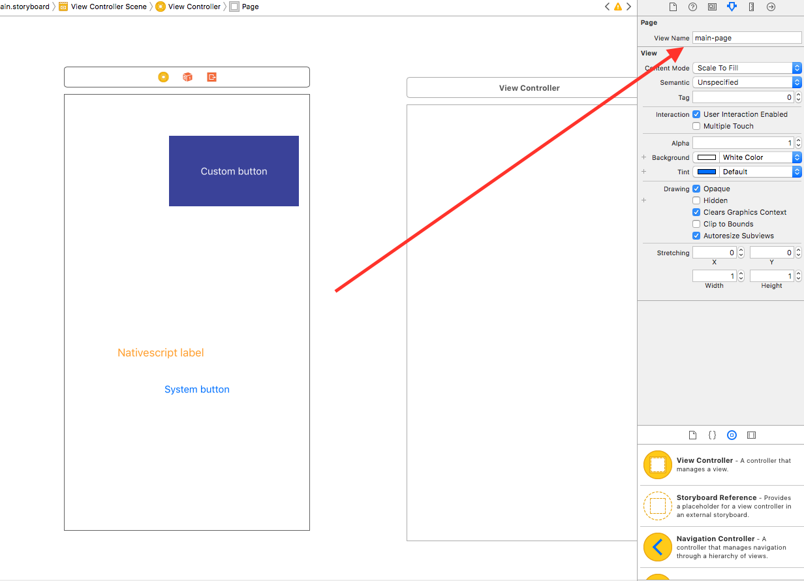
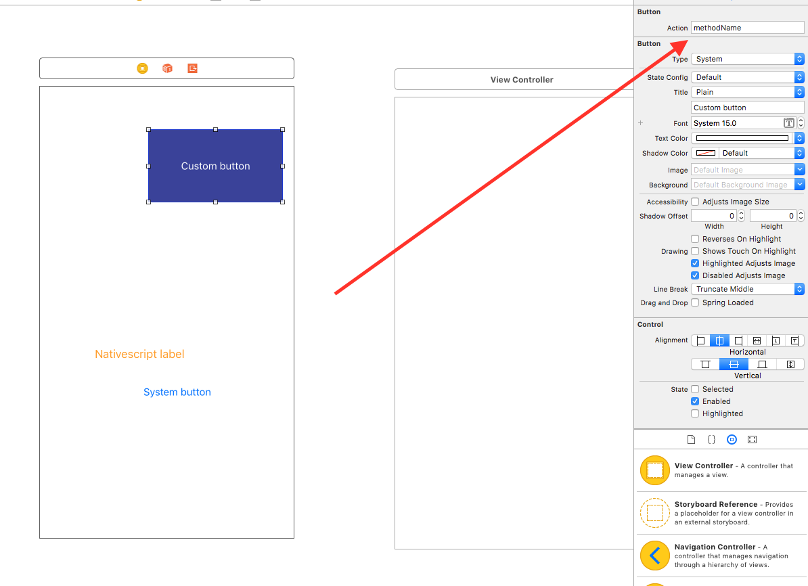
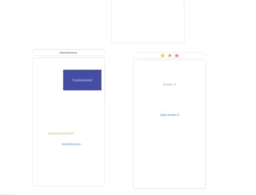
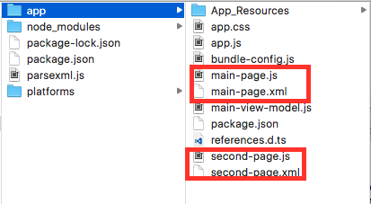
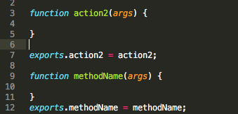
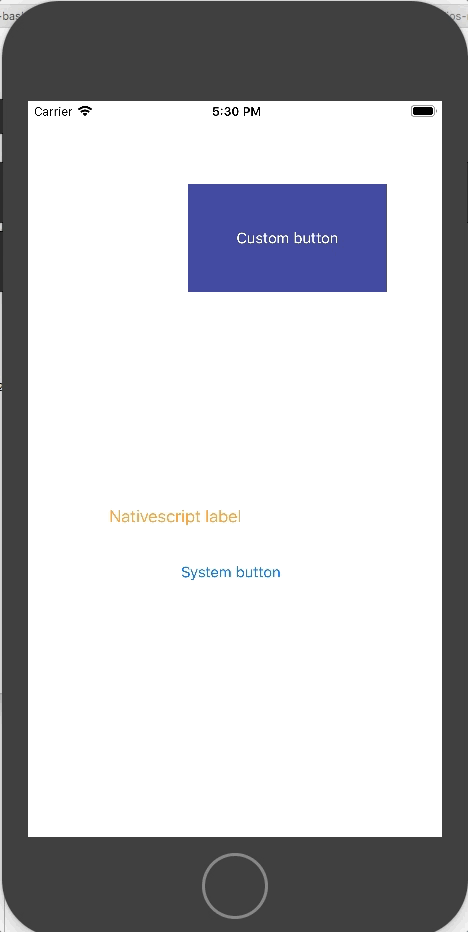
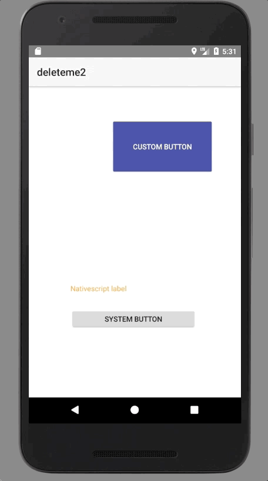

The following project is on a rather POC stage. Its main target is to allow NativeScript developers to leverage the power of iOS storyboards for building the UI. What the `parsexml.js` script is doing is parsing the storyboards `xml` files to JS objects and then to NativeScript `xml` and corresponding `js` files.

####So far the script translates only Button and Label elements and uses their absolute position instead of constraints. 

## Usage

Here is how you can use the example `.storyboard` file to play with the parser script:

1.Create a new NS project:

`` tns create nativescript-storyboard``

2.Generate the .xcodeproj:

``cd nativescript-storyboard``

``tns platform add ios``

3.Open the generated XCode project from `platforms/ios`

4.Drag **Main.storyboard**, **TNSButton.h**, **TNSButton.m**, **TNSPage.h** and **TNSPage.m** into the XCode project and leave *Copy items if needed* selected.

#####Make sure the files are added to the app target

You will notice that both viewcontrollers' root views are subclasses of ``TNSPage``. This allow us to set a property called ``View Name`` which is used by the parser script for setting the names of the generated files (``main-page.xml``, ``main-page.js``).

If you select any of the buttons there is a field called ``Action``. This will create a function with the same name in the generated js file.

You can move the buttons and labels around the view as well as change their titles, title and background colors as well as play with the segues.

5.Copy **parsexml.js** file in your NS project root folder.

6.Make sure you have *xml2js* and *xmlbuilder* npm modules installed.

7.From the *General* tab of the XCode project set *Deployment target* to 9.0 or higher

8.Open *parsexml.js* and make sure the ``storyboardPath`` variable is properly set. It should be pointing to the storyboard to be parsed.Then run *parsexml.js*

``node parsexml.js``

9.The ``xml`` and ``js`` files should be generated in the ``app`` folder. You will find out they are named just as the ``View Name`` fields we populated and the ``main-page.js`` contains functions named just as our buttons ``Action fields``.

10.Run ``tns run ios``:

11.Run ``tns run android``

##The segues have taken effect as well!

