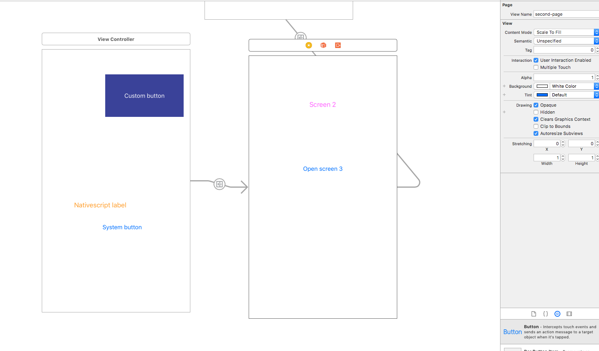
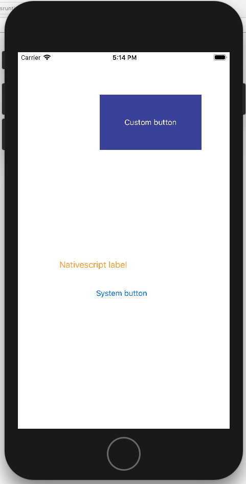
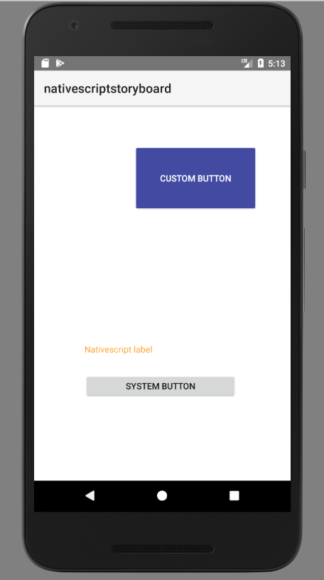

The following project is on a rather POC stage. Its main target is to allow NativeScript developers to leverage the power of iOS storyboards for building the UI. What the `parsexml.js` script is doing is parsing the storyboards `xml` files to JS objects and then to NativeScript `xml` and corresponding `js` files.

## Usage

1.Create a new NS project:

`` tns create nativescript-storyboard``

2.Generate the .xcodeproj:

``cd nativescript-storyboard``

``tns platform add ios``

3.Open the generated XCode project from `platforms/ios`

4.Drag **Main.storyboard**, **TNSButton.h**, **TNSButton.m**, **TNSPage.h** and **TNSPage.m** into the XCode project and leave *Copy items if needed* selected.

5.Copy **parsexml.js** file in your NS project root folder.

6.Make sure you have *xml2js* and *xmlbuilder* npm modules installed.

7.From the *General* tab of the XCode project set *Deployment target* to 9.0 or higher

8.Run *parsexml.js*

``node parsexml.js``

9.Run ``tns run ios``

10.Run ``tns run android``

